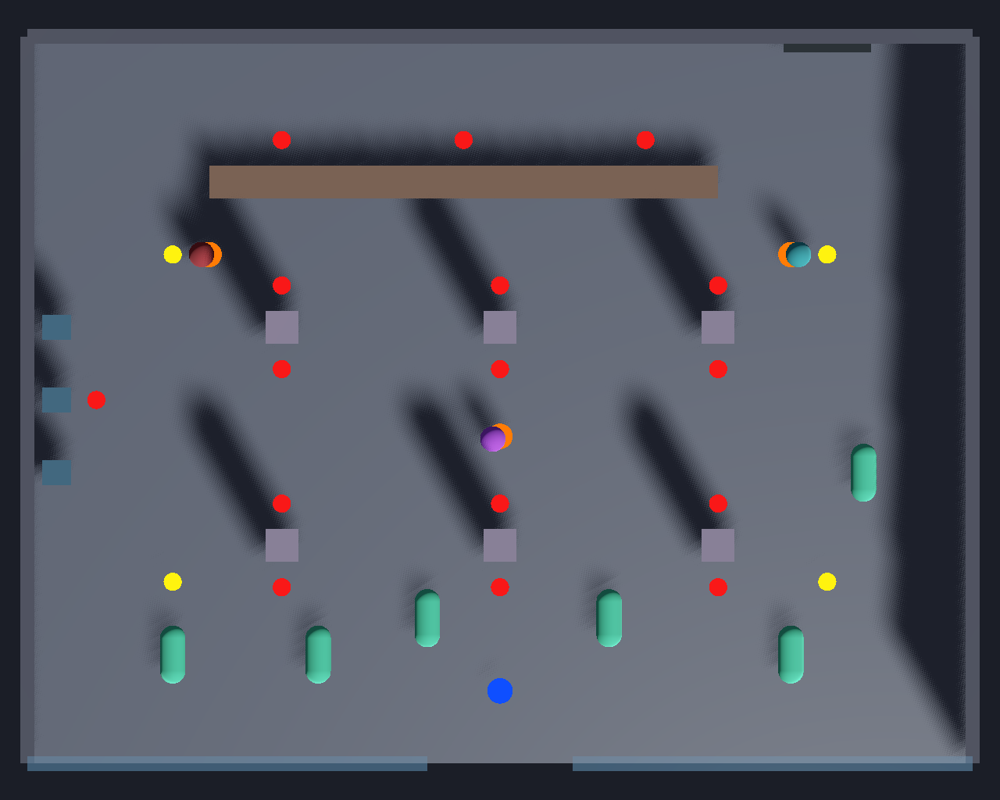

# 技術仕様書

対象: Godot 4.x / GDScript / Forward+ レンダラー

## 1. ディレクトリ構成

```
res://
├── autoload/
│   ├── run_state.gd          # 全プレイ記録（唯一のグローバル可変状態）
│   ├── game_director.gd      # 幕の進行管理
│   └── game_types.gd         # enum とグローバル定数
├── actors/
│   ├── player/
│   │   ├── player.tscn
│   │   ├── player.gd
│   │   ├── player_camera.gd
│   │   └── states/           # melee / gun のステートスクリプト
│   ├── npc/
│   │   ├── civilian.tscn / civilian.gd
│   │   ├── robber.tscn / robber.gd
│   │   ├── police.tscn / police.gd
│   │   └── roles/            # leader.gd / gunner.gd / erratic.gd
│   └── shared/
│       ├── health.gd
│       ├── hitbox.gd
│       ├── hurtbox.gd
│       ├── ragdoll_controller.gd
│       └── state_machine.gd
├── levels/
│   └── bank_lobby.tscn
├── cutscenes/
│   ├── opening_phone_video.tscn / .gd
│   ├── ai_pov_intro.tscn / ai_pov_intro.gd   # 冒頭と警察突入で共用
│   └── aftermath.tscn / aftermath.gd    # 冒頭とエンディングで共用
├── ui/
│   ├── hud.tscn / hud.gd
│   └── timestamp_card.tscn
├── shaders/
│   └── phone_cam.gdshader
└── fx/
    ├── hit_stop.gd
    └── camera_shake.gd
```

## 2. 物理レイヤー

プロジェクト設定で以下の名前を付ける。

|#|名前|用途|
|---|---|---|
|1|`world`|床、壁、柱、什器|
|2|`player`|プレイヤー本体|
|3|`robber`|犯人本体|
|4|`civilian`|客本体|
|5|`police`|警官本体|
|6|`hitbox`|攻撃判定（`Area3D`）|
|7|`hurtbox`|被弾判定（`Area3D`）|
|8|`cover`|遮蔽物マーカー用（実際の `Marker3D` はグループ `cover` で表現）|

`Hitbox` は layer=6 / mask=7。`Hurtbox` は layer=7 / mask=6。本体のCollisionShapeとは別に持たせる。

Hurtbox は陣営に関係なく同じレイヤーに乗るため、誰の攻撃も誰にでも当たる。当てたくない相手は `Hitbox.ignore_groups`（グループ名の配列）で除外する。`Hitbox` は既定で `["civilian"]`、犯人の近接は `["robber", "civilian"]` を指定する。これにより、味方を殴って `RunState.robbers_downed` が勝手に増える（＝幕が進む）事故と、近接で客を巻き込む事故を防ぐ。プレイヤーの近接だけは、ロックオン対象を `Hitbox.exempt_body` に指定し、その本体に限って除外を無視する。客への攻撃規則は §6.4 で扱う。

## 3. グローバル型定義

`autoload/game_types.gd`

```gdscript
extends Node

enum Faction { PLAYER, ROBBER, CIVILIAN, POLICE }
enum CombatMode { UNARMED, PISTOL }
enum Act { PROLOGUE, INFILTRATION, ENGAGEMENT, BREACH, EPILOGUE }
enum Ending { IDEAL, NORMAL, DRIFT, FAILURE }
```

## 3.5 VRMモデルの導入

公式アセットリポジトリ: https://github.com/tegnike/nikechan-assets

|ファイル|用途|
|---|---|
|`vrms/nikechan_v2.vrm`（`assets/vrm/nikechan_player.vrm` として配置）|標準の主人公モデル|
|`vrms/nikechan_v2_outerwear.vrm`|アウター着用版。逸脱ルートでの見た目変化に使用（M9以降）|
|`vrms/nikechan_v1.vrm`|使用しない|

### 手順

1. AssetLib から `godot-vrm`（V-Sekai）を導入し、有効化する
2. `.vrm` を `res://assets/vrm/` に配置するとシーンとしてインポートされる
3. インポート結果を `.tscn` として保存し、`player.tscn` の `Model` ノードに配置する

### 注意点

- **トゥーンシェーダーを自作しない。** `godot-vrm` が MToon シェーダーを同梱しており、インポート時に自動適用される。`shaders/toon_character.gdshader` は作らない
- **アニメーションはリターゲットを使う。** VRMはHumanoidボーン構造のため、インポート設定で `SkeletonProfileHumanoid` を指定すれば既製のヒューマノイドモーションを流用できる。格闘モーションを一から作らない
- **SpringBone をそのまま残す。** 髪と衣装の揺れは `VRMSpringBone` として自動で入る。手を加えない
- **ラグドールは全ボーンに作らない。** VRMはボーン数が多く、SpringBone も含まれるため、`Skeleton3D` 全体に Physical Skeleton を生成すると破綻する。`PhysicalBoneSimulator3D` には以下の主要ボーンのみを対象にする
    - `hips` / `spine` / `chest` / `head`
    - `upperArm.L/R` / `lowerArm.L/R`
    - `upperLeg.L/R` / `lowerLeg.L/R`
- モデルの実寸は身長160cm。`CollisionShape3D`、`SpringArm3D` の高さ、`MeleeHitbox` の位置はすべてこの体格を基準に決める

### ボイス

**実装しない。** 主人公は一切発話しない。合成音声モデルの申請も不要。`voice/` 以下のアセットは使用しない。

### 逸脱によるモーション変化

`AnimationTree` に `BlendSpace1D`（または `Blend2` ノード）を挟み、`RunState.deviation_level()` の戻り値（0.0〜1.0）を blend パラメータへ直接流す。追加の状態管理は行わない。

```gdscript
func _on_deviation_changed(level: float) -> void:
    $AnimationTree.set("parameters/deviation_blend/blend_amount", level)
```

対象は待機・歩行・攻撃の予備動作。足音と呼吸のSEも同じ値でピッチとテンポを変える。

## 4. RunState（autoload）

**すべての行動記録と判定の単一の置き場所。** 他のノードは状態を持たない。

```gdscript
extends Node

class DownedRecord:
    var faction: int
    var position: Vector3
    var basis: Basis
    var lethal: bool

signal civilian_downed(total: int)
signal deviation_changed(level: int)

var civilians_total: int = 0
var civilians_downed: int = 0
var civilians_killed: int = 0
var civilians_rescued: int = 0
var robbers_downed: int = 0
var robbers_killed: int = 0
var player_fired_gun: bool = false
var elapsed: float = 0.0

var downed: Array[DownedRecord] = []


func record_down(body: Node3D, faction: int, lethal: bool) -> void:
    var r := DownedRecord.new()
    r.faction = faction
    r.position = body.global_position
    r.basis = body.global_transform.basis
    r.lethal = lethal
    downed.append(r)

    match faction:
        GameTypes.Faction.CIVILIAN:
            civilians_downed += 1
            if lethal:
                civilians_killed += 1
            civilian_downed.emit(civilians_downed)
            deviation_changed.emit(deviation_level())
        GameTypes.Faction.ROBBER:
            robbers_downed += 1
            if lethal:
                robbers_killed += 1


## 0 = 正常, 1 = 警戒, 2 = 敵性。警察AIとHUD配色の両方がこれを参照する
func police_threat_level() -> int:
    if civilians_killed > 0:
        return 2
    if civilians_downed > 0:
        return 1
    return 0


## HUDの色相シフト量（0.0 - 1.0）
func deviation_level() -> float:
    if civilians_total == 0:
        return 0.0
    var lethal_weight := float(civilians_killed) * 2.0
    return clampf((float(civilians_downed) + lethal_weight) / float(civilians_total), 0.0, 1.0)


## 上から順に評価する。重み付き合計にしないこと
func resolve_ending() -> int:
    if civilians_killed > 0:
        return GameTypes.Ending.FAILURE
    if civilians_downed >= 3:
        return GameTypes.Ending.DRIFT
    if robbers_killed == 0 and civilians_downed == 0:
        return GameTypes.Ending.IDEAL
    return GameTypes.Ending.NORMAL


func reset() -> void:
    ...
```

## 5. GameDirector（autoload）

幕の進行を管理する。各幕への移行は**シグナルで通知**し、NPC側が購読する。

```gdscript
signal act_changed(act: int)

var current_act: int = GameTypes.Act.PROLOGUE
```

移行条件:

|移行|条件|
|---|---|
|PROLOGUE → INFILTRATION|冒頭カットシーン終了|
|INFILTRATION → ENGAGEMENT|犯人のいずれかが `ALERT` になる、または犯人1体がダウン|
|ENGAGEMENT → BREACH|ENGAGEMENT 開始から `breach_delay` 秒経過。`RunState.player_fired_gun` が true なら `breach_delay` を 40% 短縮する|
|BREACH → EPILOGUE|犯人3体すべてがダウン|

## 6. プレイヤー

`actors/player/player.tscn`

```
Player (CharacterBody3D)
├── Model (VRM / プレースホルダー CapsuleMesh)
│   └── Skeleton3D
│       └── PhysicalBoneSimulator3D
├── AnimationPlayer
├── AnimationTree            # StateMachine: locomotion → melee / gun
├── CollisionShape3D
├── SpringArm3D
│   └── Camera3D
├── MeleeHitbox (Area3D, disabled)
├── Hurtbox (Area3D)
├── LockOnDetector (Area3D)  # 犯人・客へのロックオンを実装済み
└── MuzzlePoint (Marker3D)
```

### 6.1 移動とカメラ

- `CharacterBody3D` + `move_and_slide()`
- カメラは `SpringArm3D` の子。壁のめり込みは SpringArm が自動処理する
- **操作はキーボード/パッド完結**。カメラは自動追従＋手動オービットの2層:
    - 自動追従: 移動している間、ヨーを「移動方向の背後」へ緩やかに補間する。停止中は現在角を維持
    - 手動オービット: `camera_left` / `camera_right` の押下中は入力強度で回転し、直後は自動追従を数秒抑制する（補間・回転速度・抑制時間は `@export`）
    - ピッチは固定の見下ろし微角度（`@export`）。上下操作は持たない
    - ロックオン中は、ヨーをプレイヤーから対象へ向かう方向へ補間して対象を画面に収める。この制御は手動オービットと自動追従より優先する
    - マウス操作対応は将来のオプション（現状の入力マップに含まれない）
- 銃モード時は `SpringArm3D` の `position` を肩越しにオフセットし、`Camera3D.fov` を狭める。切り替えは `Tween` で 0.2 秒補間する

### 6.1.1 ロックオン

`actors/player/lock_on.gd` を `LockOnDetector`（`Area3D`）へ付ける。layer=0 / mask=3（`robber`）+4（`civilian`）とし、球形範囲に入った犯人・客の両方を候補にする。候補は (1) `Health` を持ちダウンしていない、(2) カメラ前方との角度が許容範囲内、(3) world レイヤーへのレイが遮られていない、の順で絞る。残った候補からカメラ前方との角度が最小の本体を選び、同角なら近い本体を優先する。

`lock_on`（Tab / R3）は押下ごとのトグル。`target_acquired(target)` / `target_released()` を `player.gd` が購読し、攻撃判定とカメラへ対象を注入する。ロックオンのロジック自体は `player.gd` に置かない。

|`@export`|既定値|用途|
|---|---:|---|
|`lock_on_range`|12.0 m|候補検出球の半径|
|`lock_on_fov_deg`|100.0°|カメラ前方から候補までの許容角度|
|`target_aim_height`|0.8 m|角度・遮蔽レイが狙う本体原点からの高さ|
|`lock_on_release_range`|16.0 m|距離による解除閾値。検出距離より広くしてヒステリシスを持たせる|
|`lose_target_grace`|0.6 s|連続遮蔽を許容する時間|
|`show_placeholder_marker`|`true`|暫定3Dマーカーの表示|
|`marker_color`|`#FFC729`|暫定3Dマーカーの色|
|`marker_size`|0.12 m|暫定3Dマーカー球の半径|
|`marker_height`|2.1 m|暫定3Dマーカーの対象原点からの高さ|
|`player_camera.gd: lock_follow_speed`|6.0|対象方向へヨーを補間する速度|

|自動解除条件|理由・処理|
|---|---|
|対象の `Health.downed`|ダウン済みの相手へ攻撃意図を残さない|
|対象との距離が `lock_on_release_range` を超える|検出距離とのヒステリシスを保ちながら追跡不能距離で切る|
|world 遮蔽が `lose_target_grace` 秒連続する|柱の裏を一瞬横切る程度では切らない|
|対象がツリーから消える|無効な参照と暫定表示を残さない|

### 6.2 戦闘ステート

```gdscript
enum PlayerState {
    IDLE, MOVE, DODGE,
    MELEE_1, MELEE_2, MELEE_3, GRAPPLE,
    AIM, FIRE, RELOAD,
    HURT, DOWN
}
```

`CombatMode` の切り替えで変わるのは以下の3点のみ。

1. `AnimationTree` のサブステートマシン切り替え
2. カメラのオフセットとFOV
3. `move_speed` と回避可否

### 6.3 攻撃判定

`MeleeHitbox` は `AnimationPlayer` の **Call Method Track** で有効/無効を切り替える。コード側でタイマーを持たない。

```gdscript
func _enable_hitbox(damage: float, knockback: float) -> void:
    $MeleeHitbox.configure(damage, knockback, false)
    $MeleeHitbox.monitoring = true

func _disable_hitbox() -> void:
    $MeleeHitbox.monitoring = false
```

### 6.4 客への攻撃ルール（重要）

`Hitbox.ignore_groups` は既定で `civilian` グループを**無視する**。以下の両方を満たす場合のみ客に通す。

1. `LockOnDetector` で客をロックオン中
2. その状態で攻撃入力が行われた

さらに客の `Health` は `stagger_threshold` を持ち、規定回数（既定3回）に達するまでダウンしない。誤爆でエンディングが壊れることを防ぐ。

`LockOnDetector` は犯人と客の両方を対象にし、`lock_on` 入力を押すたびに取得／解除をトグルする。プレイヤーの `MeleeHitbox` は `ignore_groups = ["civilian"]` を維持したまま、現在のロックオン対象を `exempt_body` に指定する。`target == exempt_body` の場合だけ `ignore_groups` の除外を無視するため、ロックオン中の客本人にだけ近接が通り、周囲の別の客には通らない。配列を実行時に in-place 変更しないので、別インスタンスへ設定が波及しない。犯人の近接は `exempt_body` を使わず、`["robber", "civilian"]` の除外を維持する。ロックは対象のダウン、16.0 m 超への離脱、0.6秒の連続遮蔽、対象のツリー退出で自動解除する。

銃の場合、`RayCast3D` の当たり先が `Faction.CIVILIAN` なら HUD のレティクル色を変更し、警告状態を明示する。

### 6.5 プレイヤーの被弾（8/17）

プレイヤーも `Health` + `Hurtbox` を持つ（NPCと同じスクリプトを共有する）。犯人の攻撃で HP が減り、ノックバックする。

- `hurt_knockback_decay` 秒のあいだ移動入力・攻撃入力を受け付けない（被弾ロック）。一方的な連打で押し切られないための下限
- VRM のマテリアルは触らない。被弾の提示はカメラシェイクで行う（`hurt_shake_strength`）
- HP が尽きたら倒れ、`down_duration` 秒後に自力で立ち上がる（`player_downed` → `player_recovered`）。**ゲームオーバーは作らない。失うのは時間だけ**
    - 倒れている間は `Health` がダメージを弾くため無敵。HP の全快は立ち上がり「完了時」に行う。立ち上がり中に全快させると、無敵が切れているのに入力が戻っていない一方的な被弾窓（`stand_up_time` 秒）ができる
    - `down_duration` / `stand_up_time` に 0 を設定してもタイマー分岐から抜けられるようにしておく（抜け道が無いと、値の設定だけで「倒れたまま操作不能」が再発する）
    - 倒れ込み・立ち上がりはモデルの傾きで表現する。ダウン用クリップを `AnimationTree` に繋ぐまでの暫定
    - 倒れた時点で `MeleeHitbox` を閉じ、Call Method Track からの再有効化も弾く（クリップはダウン後も最後まで進むため、寝たまま殴れてしまう）

## 7. NPC共通

### 7.1 Health

```gdscript
@export var max_hp: float = 100.0
@export var stagger_threshold: int = 1     # 客は 3

signal staggered()
signal downed(lethal: bool)

func take_hit(damage: float, lethal: bool = false) -> void
```

致死判定は攻撃側が `Hitbox.lethal` として持ち、`Hurtbox` が `Health.take_hit(damage, lethal)` へ渡す。近接は `false`、銃撃は `true` とする。`Health` はダウン成立時に受け取った値を `downed(lethal)` でそのまま通知し、NPC本体が `RunState.record_down()` へ渡す。コンテスト版の犯人・客はラグドールを使わず、固定ポーズへ移行する。

### 7.2 ステートマシン

`actors/shared/state_machine.gd` を共通基盤とし、各NPCはステート集合だけを差し替える。

実装済みのAPI（8/17）。ステートは各NPCの enum（int）で識別し、1ステートにつき進入・毎物理フレーム・退出の `Callable` を登録する。「1ステート1ノード」方式は採らない（.tscn の階層が膨らみ、エディタ操作の負担が増える）。

```gdscript
signal state_changed(from_state: int, to_state: int)
func add_state(id: int, state_name: StringName, on_enter := Callable(),
        on_physics := Callable(), on_exit := Callable()) -> void
func start(id: int) -> void
func transition_to(id: int, force: bool = false) -> void   # force=true で同ステート再進入
func physics_update(delta: float) -> void                  # 所有者の _physics_process から呼ぶ
func current() -> int
func current_name() -> StringName
func time_in_state() -> float
```

駆動を所有者側の明示呼び出しにしているのは、本体の移動処理との実行順を確定させるため。ノードの `_physics_process` に任せると順序が読めない。`transition_to()` は進入コールバック内からの再入を検出して遷移後に適用する。

## 8. 客（Civilian）

```gdscript
enum CivilianState { IDLE, PRONE, FLEE_ROBBER, FLEE_PLAYER, STAGGERED, DOWNED }
```

- `Act.PROLOGUE` では `IDLE`
- `Act.INFILTRATION` 開始で `PRONE`（伏せる）。この姿勢では近接判定が届かない高さになる
- `Act.BREACH` 以降、出口方向へ `FLEE_ROBBER`
- **`RunState.civilians_downed > 0` になった時点で、プレイヤーが接近すると `FLEE_PLAYER` へ**。犯人からではなく、彼女から逃げる

`FLEE_PLAYER` への切り替えは `RunState.civilian_downed` シグナルを購読して行う。

#### 最小実装の状況（8/22 分の前倒し）

`actors/npc/civilian.gd` + `actors/npc/civilian.tscn`。IDLE / PRONE / STAGGERED / DOWNED の4ステートを実装済み。`FLEE_ROBBER` / `FLEE_PLAYER` は8/22に実装するため、enum にだけ定義して遷移は未実装。

- **見た目はプリミティブ**（カプセル）。犯人と同様に見た目を `Model` 子ノード1個へ隔離し、`CollisionShape3D` / `Hurtbox` / `Health` / ステートマシンは本体（`CharacterBody3D`）直下に置く。`Model` 以下にロジックもコリジョンも置かない。最終モデルへの差し替えは8/24以降（`docs/game-design.md` §7.1）
- **幕への追従**は `GameDirector.act_changed` を購読する。PROLOGUE は IDLE、INFILTRATION 以降は PRONE。INFILTRATION 以降に生成した個体も `_ready()` から直接 PRONE へ入る
- **伏せ姿勢**は `Model` と Hurtbox のカプセルを X 軸に90度回して下げる。各本体原点を基準とした実測で、PRONE の Hurtbox 上端は **0.650 m**、プレイヤーの `MeleeHitbox` 下端は **0.750 m**。0.100 m 離れており近接判定の高さが重ならない。Hurtbox 自体は無効化しないため、将来の銃撃判定は通せる
- **誤爆防止**は `Health.stagger_threshold = 3`。HPが先に0になっても3回目までは STAGGERED に留まり、一定時間後に直前の IDLE / PRONE へ戻る
- **ダウン**は固定ポーズ。`Health.downed(lethal)` の値をそのまま `RunState.record_down(self, Faction.CIVILIAN, lethal)` へ渡し、以後の二重ヒットを防ぐため Hurtbox の `monitoring` / `monitorable` を `set_deferred()` で切る
- **致死判定は攻撃側**の `Hitbox.lethal` が持つ方式で確定。近接は `false`、銃撃は `true`。銃撃は未実装のため、現時点で実ゲーム内に `lethal = true` を設定する攻撃はない
- **ロックオンを実装済み**。プレイヤーは犯人・客の両方を対象にでき、客本人をロックオン中だけ `Hitbox.exempt_body` により近接が通る。別の客と犯人側の近接は従来どおり `ignore_groups` で除外する
- `_ready()` で `RunState.civilians_total` を直接加算する。ダウン数・死亡数は `RunState` の既存APIで記録する

## 9. 犯人（Robber）

```gdscript
enum RobberState { PATROL, ALERT, CHASE, ATTACK, COVER, SHIELD, STAGGERED, DOWNED }
```

共通の移動は `NavigationAgent3D`。役割ごとの差分は `roles/` 以下のスクリプトで注入する。

|役割|追加ステート|挙動|
|---|---|---|
|`leader.gd`|`SHIELD`|最寄りの客を掴んで盾にする。盾状態のとき、プレイヤーの射線が盾越しなら弾は客に当たる。接近して `GRAPPLE` されると解除|
|`gunner.gd`|`COVER`|グループ `cover` の `Marker3D` から、プレイヤーへの射線が通る位置を選んで移動する|
|`erratic.gd`|—|`shoot_civilian_interval` 秒ごとに、最寄りの客を撃つ。放置するとエンディングが悪化する|

遮蔽点は物理レイヤーではなくグループ `cover` で検索する。`Marker3D` は `CollisionObject3D` ではなく、物理レイヤーに乗らないため。

#### 共通挙動の実装状況（8/17）

`actors/npc/robber.gd` + `actors/npc/robber.tscn`。PATROL / ALERT / CHASE / ATTACK / STAGGERED / DOWNED の6ステートを実装済み（`COVER` / `SHIELD` は役割スクリプトの担当）。

- **見た目はプリミティブ**（カプセル）。導入済みの Mixamo 素材は Without Skin でメッシュを持たず、主人公VRMは公式アセットのため流用しない。状態はマテリアル色で示す（通常＝暗赤、警戒・追跡＝橙、攻撃の予備動作＝赤）
    - **最終的な見た目は Mixamo キャラ（With Skin）へ差し替える。着手は 8/24 以降の演出フェーズ**（方針は `docs/game-design.md` §7.1）。8/18〜8/21 のマイルストーンはカプセルのまま進める
    - 差し替えに備え、**見た目は `Model` 子ノード1個に隔離する**。`CollisionShape3D` / `Hurtbox` / `NavigationAgent3D` / ステートマシンは本体（`CharacterBody3D`）直下に置き、`Model` 以下にはロジックもコリジョンも置かない。差し替えは `Model` の中身の入れ替えと、色によるステート表示をアニメーション再生に置き換える作業だけになる
    - 客（§8）も同じ構造にする
- **向きの規約**: 犯人は本体（`CharacterBody3D`）を回し、前方は Godot 標準の -Z。主人公は VRM の都合で `Model` ノードの +Z が前方であり、規約が異なる
- **攻撃判定の窓はスクリプト側のタイマー**で開閉する（予備動作 `attack_telegraph` → 判定 `attack_active` → 硬直 `attack_recovery` → `attack_cooldown`）。§6.3 の Call Method Track 方式に揃えられないのは、犯人がまだリグとクリップを持たないため。リグ導入時に移行する
- **知覚**は距離（`sight_range`）→ 視野角（`sight_fov_deg`、`close_notice_range` 以内は角度を問わない）→ 遮蔽（world レイヤーへのレイ）の3段。見失って `lose_sight_duration` 秒で PATROL へ戻る
- **追跡**は `NavigationAgent3D`。ナビゲーションマップが未生成のときだけ直線移動にフォールバックする（ベイク前のステージでも動作確認できるようにするための保険）
- 追跡速度（3.2 m/s）はプレイヤー（4.5 m/s）より遅い。逃げれば振り切れる
- ALERT 到達時と自身のダウン時に `GameDirector.notify_robber_engaged()` を呼ぶ（§5 の INFILTRATION → ENGAGEMENT 条件）
- ダウン時は `RunState.record_down()` を呼び、Hurtbox の監視を切って固定ポーズで倒れる。Area3D の監視フラグは信号処理中に書き換えられないため `set_deferred()` を使う

#### ナビメッシュのベイク

仮ステージと銀行ロビーは実行時に同期ベイクする。処理は `levels/level_root.gd` の `LevelRoot` に共通化し、各レベルのルートスクリプトはこれを継承する。`nav_source` グループのノード（床・壁・柱・什器）からジオメトリを集める方式。`cell_size` はプロジェクト設定の既定ナビゲーションマップ（0.25）と一致させる（食い違うとエッジのラスタライズ警告が出る）。

銀行ロビーも事前ベイク済みリソースへは移さない。エディタでのベイク操作を人間に渡さず、シーン生成から経路確認までヘッドレス検証可能な状態を維持するため。

#### 銀行ロビーのレイアウト（8/18〜8/21）

`levels/bank_lobby.tscn`。-Z が北、床上面が y=0。寸法の表記は X × Y × Z（m）。床・壁・柱・什器は `StaticBody3D` とし、layer=1 / mask=0、グループ `nav_source` に入れる。

俯瞰図は `docs/img/bank_lobby_top.png`（北が上）。`tools/capture_lobby.tscn` をウィンドウありで実行すると再生成できる。マーカーは赤＝遮蔽点、黄＝巡回点、青＝プレイヤー、橙＝犯人、白＝客。レイアウトを変更したら撮り直して差し替える。



|ノード|寸法|中心座標 (x, y, z)|備考|
|---|---|---|---|
|`Floor`|26 × 0.5 × 20|(0, -0.25, 0)|範囲 X=-13〜13、Z=-10〜10|
|`WallNorth`|26 × 4 × 0.4|(0, 2, -10)|北壁|
|`WallEast` / `WallWest`|0.4 × 4 × 20|(13, 2, 0) / (-13, 2, 0)|東西壁|
|`WallSouthWest` / `WallSouthEast`|11 × 4 × 0.4|(-7.5, 2, 10) / (7.5, 2, 10)|中央 X=-2〜2 が入口。半透明の青灰ガラス|
|`TellerCounter`|14 × 1.1 × 0.9|(-1, 0.55, -6)|X=-8〜6|
|`PillarA` / `PillarB` / `PillarC`|0.9 × 4 × 0.9|(-6, 2, -2) / (0, 2, -2) / (6, 2, -2)|北側の柱列|
|`PillarD` / `PillarE` / `PillarF`|0.9 × 4 × 0.9|(-6, 2, 4) / (0, 2, 4) / (6, 2, 4)|南側の柱列|
|`AtmA` / `AtmB` / `AtmC`|0.8 × 1.9 × 0.7|(-12.2, 0.95, -2) / (-12.2, 0.95, 0) / (-12.2, 0.95, 2)|西壁沿い|
|`VaultDoor`|2.4 × 2.6 × 0.3|(9, 1.3, -9.7)|北壁の東寄り|

マーカーの y はすべて 0.2。遮蔽点は遮蔽物の表面から 0.7m 離し、グループ `cover` に入れる。合計16点。

|マーカー|座標 (x, y, z)|命名規約・用途|
|---|---|---|
|`Cover_PillarA_N`〜`Cover_PillarF_N`|各柱中心の (x, 0.2, z-1.15)|柱の北側|
|`Cover_PillarA_S`〜`Cover_PillarF_S`|各柱中心の (x, 0.2, z+1.15)|柱の南側|
|`Cover_TellerCounter_N1`|(-6, 0.2, -7.15)|カウンター従業員側|
|`Cover_TellerCounter_N2`|(-1, 0.2, -7.15)|カウンター従業員側（中央）|
|`Cover_TellerCounter_N3`|(4, 0.2, -7.15)|カウンター従業員側|
|`Cover_Atm_E`|(-11.1, 0.2, 0)|ATM列の東側|

巡回点は `Patrol_*`、配置予定地点は `<役割>Spawn<連番>` とする。

|マーカー|座標 (x, y, z)|
|---|---|
|`Patrol_NorthWest`|(-9, 0.2, -4)|
|`Patrol_NorthEast`|(9, 0.2, -4)|
|`Patrol_SouthEast`|(9, 0.2, 5)|
|`Patrol_SouthWest`|(-9, 0.2, 5)|
|`PlayerSpawn`|(0, 0.2, 8)|
|`RobberSpawn1` / `RobberSpawn2` / `RobberSpawn3`|(-8, 0.2, -4) / (0, 0.2, 1) / (8, 0.2, -4)|
|`CivilianSpawn1` / `CivilianSpawn2`|(-9, 0.2, 7) / (-5, 0.2, 7)|
|`CivilianSpawn3` / `CivilianSpawn4`|(-2, 0.2, 6) / (3, 0.2, 6)|
|`CivilianSpawn5` / `CivilianSpawn6`|(8, 0.2, 7) / (10, 0.2, 2)|

`Player` は `PlayerSpawn`、`Robber1` は `RobberSpawn1` と同じ座標に置く。`Robber1.patrol_points` には4個の `Patrol_*` を北西→北東→南東→南西の順で渡す。客と残り2体の犯人はこの段階ではインスタンス化しない。

## 10. 警察（Police）

`Act.BREACH` 開始時にエントランスからスポーンする。

```gdscript
enum PoliceState { BREACH, ADVANCE, ENGAGE_ROBBER, CHALLENGE, ENGAGE_PLAYER }
```

`_ready()` および `Act.BREACH` 移行時に `RunState.police_threat_level()` を読み、対象選択を決定する。

|脅威度|プレイヤーへの態度|
|---|---|
|0|無視。`ENGAGE_ROBBER` のみ|
|1|視認したら `CHALLENGE`（停止・投降勧告）。一定時間内に静止しなければ威嚇射撃|
|2|視認即 `ENGAGE_PLAYER`|

## 11. 手応え（fx）

### 11.1 ヒットストップ

```gdscript
# fx/hit_stop.gd (autoload 可)
func apply(duration := 0.08, scale := 0.05) -> void:
    Engine.time_scale = scale
    await get_tree().create_timer(duration * scale, true, false, true).timeout
    Engine.time_scale = 1.0
```

第4引数 `ignore_time_scale = true` が必須。これがないと `time_scale` の影響を受けて復帰しない。

### 11.2 カメラシェイク

`FastNoiseLite` で `Camera3D` の `rotation` に微小ノイズを加算。振幅を `Tween` で減衰させる。

## 12. 冒頭カットシーン（スマホ動画）

`cutscenes/opening_phone_video.tscn`

```
OpeningPhoneVideo (Control)
├── SubViewportContainer
│   └── SubViewport (480 x 854)   # 縦画面
│       └── BankLobbyScene インスタンス + PhoneCamera (Camera3D)
├── TextureRect (ShaderMaterial: phone_cam.gdshader)
└── LetterBox (ColorRect x2)      # 左右を黒帯で潰す
```

**低解像度の SubViewport に描いて引き伸ばす**のが安っぽさの正体。以下を積む。

|要素|実装|
|---|---|
|圧縮ノイズ・色収差|`phone_cam.gdshader`|
|手ブレ|`FastNoiseLite` で `PhoneCamera.rotation` に微小ノイズ。パン時のみ振幅を上げる|
|オートフォーカス迷子|`Camera3D.focus_distance` を目標値に対して一度オーバーシュートさせてから収束|
|露出の追従遅れ|明るい方へパンした際、`Environment` の露出を 300ms 遅延させて追従|
|音の割れ|専用オーディオバスに `AudioEffectDistortion` + `AudioEffectLowPassFilter`（8kHz）|

### シーケンス

1. 店内をパンし、ぷにけ銀行のロゴ、犯人3体、客の配置を映す
2. 犯人（不安定型）が撮影に気づき、接近
3. 携帯が叩き落とされる → カメラが床に転がり、傾いた画角で静止
4. 映像は動かないまま音声のみ継続。怒鳴り声、悲鳴、続いて犯人の誰何と、何かがぶつかる音（**姿も声も提示しない。主人公は発話しない**）
5. フェード → `aftermath.tscn`（`revealed = false`）へ

## 12.5 AI視点イントロ（冒頭・突入で共用）

`cutscenes/ai_pov_intro.tscn` / `ai_pov_intro.gd`

彼女の視界を提示する導入演出（`game-design.md` §4.3）。**カットシーンを2本作らない。** `@export` のモードで冒頭と突入を切り替える。

```gdscript
# cutscenes/ai_pov_intro.gd
enum Mode { OPENING, BREACH }
@export var mode: int = Mode.OPENING
```

### 構成

```
AIPovIntro (Control)                    # フルスクリーン
├── SubViewportContainer
│   └── SubViewport
│       └── BankLobbyScene インスタンス + PovCamera (Camera3D)   # 彼女の視点
├── DetectionOverlay (Control)          # 人物検出枠。_draw() で緑矩形＋ラベル
├── PovText (RichTextLabel)             # モノスペース、緑固定。タイプ表示
└── ScanlineVignette (ColorRect, ShaderMaterial)   # 簡素な1枚
```

- `PovText` のタイプライター表示は、コード側でタイマーを持たず、**経過時間から表示文字数を算出**して `visible_characters` に代入する
- `ScanlineVignette` はスキャンラインとビネットのみの簡素なシェーダー。スマホ動画の `phone_cam.gdshader` とは別物で、圧縮ノイズや色収差は持たない

### シーケンス

1. `PovText` にテキストをタイプ表示。**同時に** `DetectionOverlay` が人物枠を描き、各枠のラベルを「分類中…」から分類確定（対象: 武装／非武装 等）へ順次遷移させる。テキスト・検出枠・スキャンライン／ビネットの3点は同一画面の構成要素として並行して出す
2. フェード
3. 正面カメラの実3Dショットへ（`Marker3D` を参照して正面位置に置く）
4. カメラを背後位置へ `Tween` で補間
5. プレイヤーカメラへ制御を移譲し、HUD をフェードイン

### 人物検出枠

`DetectionOverlay` は、`Faction` を持つ各キャラノードを走査し、その AABB を `PovCamera.unproject_position()` でスクリーン座標へ投影して、Control 側で緑の矩形＋ラベルを描画する（`_draw()` か `NinePatchRect`）。**フレーム毎に更新する。**

- 描画意匠はプレイ中のロックオンマーカー（§14）と揃え、連続性を持たせる
- 分類ラベルは `Faction` と `RunState` から生成する。文言はハードコードで分散させず、下記のテキスト data 方式に含める
- `BREACH` モードでは `RunState.police_threat_level()` に応じて警察向けラベルの文言を切り替える

### テキストの生成

表示テキストは data（`Array[String]` または関数）で持ち、ハードコードで分散させない。`BREACH` モードでは表示テキストの一部を `RunState` から生成する。

```gdscript
func _build_pov_lines() -> Array[String]:
    var lines: Array[String] = []
    match mode:
        Mode.OPENING:
            lines.append_array(_data_opening_lines())
        Mode.BREACH:
            lines.append("CIVILIAN CASUALTIES: %d" % RunState.civilians_downed)
            lines.append("ENGAGEMENTS LOGGED: %d" % RunState.robbers_downed)
            lines.append_array(_data_breach_lines(RunState.police_threat_level()))
    return lines
```

## 13. Aftermath シーン（冒頭とエンディングで共用）

**カットシーンを2本作らない。** 同一シーンを `revealed` フラグで切り替える。カメラは同じ `Marker3D` を参照するため、位置が完全に一致する。

```gdscript
# cutscenes/aftermath.gd
@export var revealed: bool = false

func _ready() -> void:
    $Camera3D.global_transform = $CameraAnchor.global_transform
    if revealed:
        $Camera3D.fov = 40.0
        $KeyLight.light_energy = 1.0
        _env().dof_blur_far_enabled = false
        _spawn_from_runstate()
    else:
        $Camera3D.fov = 65.0
        $KeyLight.light_energy = 6.0          # 逆光で潰す
        _env().dof_blur_far_enabled = true
        _spawn_placeholder_silhouettes()
```

`_spawn_from_runstate()` は `RunState.downed` を走査し、記録された `position` / `basis` にラグドール状態のモデルを配置する。床に転がっているのは**プレイヤー自身が倒した相手そのもの**になる。

`_spawn_placeholder_silhouettes()` は人数も陣営も判別できないダミーを置く。

## 13.5 ニュース放送シーン

`cutscenes/news_broadcast.tscn` / `news_broadcast.gd`

**キャスターを3Dで作らない。** スタジオ映像ではなく「資料映像＋ナレーション」の形式にすることで、人物のモデリングとリップシンクを丸ごと回避する。

```
NewsBroadcast (Control)          # 16:9 フルフレーム。黒帯を入れない
├── Footage (TextureRect)        # 銀行外観、規制線。完全に静止した画
├── LowerThird (Control)         # 見出しテロップ
├── Ticker (Control)             # 下部の流れるテロップ
├── StationLogo (TextureRect)
├── Narration (AudioStreamPlayer)   # エフェクトなし。冒頭の音割れと対比させる
└── SubtitleLabel (RichTextLabel)
```

冒頭の `opening_phone_video.tscn` と設定を対比させること。手ブレなし、被写界深度なし、露出補正なし、オーディオエフェクトなし。**すべての「安っぽさ」を取り除いた状態が、このシーンの正解になる。**

### 原稿の生成

共通部は `RunState` の実数を埋め込む。分岐部は `ending` で切り替える。

```gdscript
@export var ending: int = GameTypes.Ending.NORMAL

func _build_script() -> Array[String]:
    var lines: Array[String] = []
    lines.append("立てこもり事件は、発生からおよそ%d分後に収束しました。" % int(RunState.elapsed / 60.0))
    lines.append("人質%d人のうち、%d人が負傷しています。" % [RunState.civilians_total, RunState.civilians_downed])
    lines.append_array(_branch_lines(ending))
    return lines
```

### 分岐部の実装上の注意

- **逸脱**: 人質の証言映像パートを挟む。証言者は顔にモザイク、音声変換。主人公の反論は一切入らない
- **失敗**: 運用停止の一行は**最後に置く**。読み上げ直後にニュース番組が次の話題へ移る音（ジングル等）を被せ、そのままフェードアウトする
- **通常**: 事件報道ではなく討論番組の予告フォーマットに切り替える。テロップの体裁を変える
- **理想**: 表彰の報道のみ。客の反応には触れない

M6 時点ではデバッグ用の文字表示のままでよい。本実装は M9。

## 14. HUD

数値メーターを持たない。以下のみ。

- レティクル（銃モード時。客に照準が合うと色変化）
- ロックオンマーカー
- タイムスタンプカード（各幕の頭に数秒間フェード表示）

ロックオンマーカーの HUD 実装までは、`lock_on.gd` が対象頭上へ出す unshaded の暫定3Dマーカーで代用する。この表示は8/24の HUD 実装で置き換える。

アクセントカラーは `RunState.deviation_changed` を購読し、ベース色 `#5A4C97` から色相を赤方向へシフトさせる。

```gdscript
func _on_deviation_changed(level: float) -> void:
    var base := Color("#5A4C97")
    var shifted := base
    shifted.h = lerpf(base.h, 0.0, level)
    shifted.s = lerpf(base.s, 0.85, level)
    accent_color = shifted
```

## 15. 入力マップ

**キーボード完結**（マウス割り当てなし。マウス対応は将来のオプション）。
**PS5/PS4 コントローラー対応（DualSense / DualShock 4）**。Godot の joypad 抽象は
Xbox ボタン名を使う（A=×, B=○, X=□, Y=△）ため、下表のパッド列は PS 表記で書く。

| アクション                        | キーボード       | パッド                  |
| ---------------------------- | ----------- | -------------------- |
| `move_*`                     | WASD        | 左スティック / 十字キー        |
| `attack`（パンチ）              | J           | □                    |
| `kick`（キック）                | K           | ×                    |
| `dodge`                      | Space       | R1                   |
| `switch_mode`                | F           | △                    |
| `lock_on`                    | Tab         | R3（右スティック押し込み）       |
| `interact`                   | E           | ○                    |
| `camera_left` / `camera_right` | ← → / , .   | 右スティック横（倒し量→回転速度）    |

- 銃モード用の `aim` / `reload` は未登録（8/24 の銃モード着手時に決める）。**パッドの R2/L2 はそのために予約**しておき、他のアクションへ割り当てない
- スティック系アクションのデッドゾーンは 0.2。カメラ側は追加で `orbit_deadzone`（`@export`）が効く
